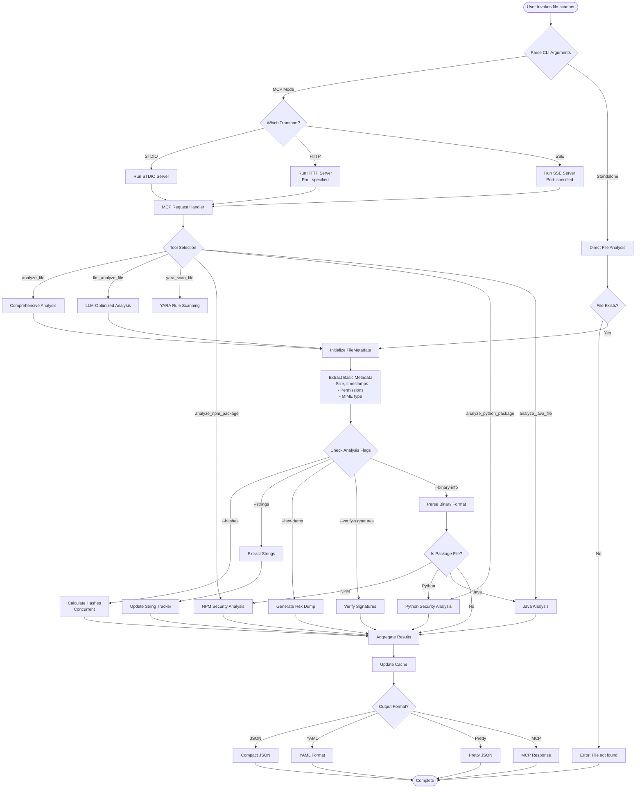
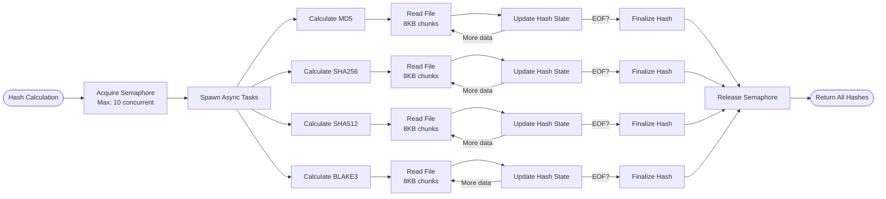
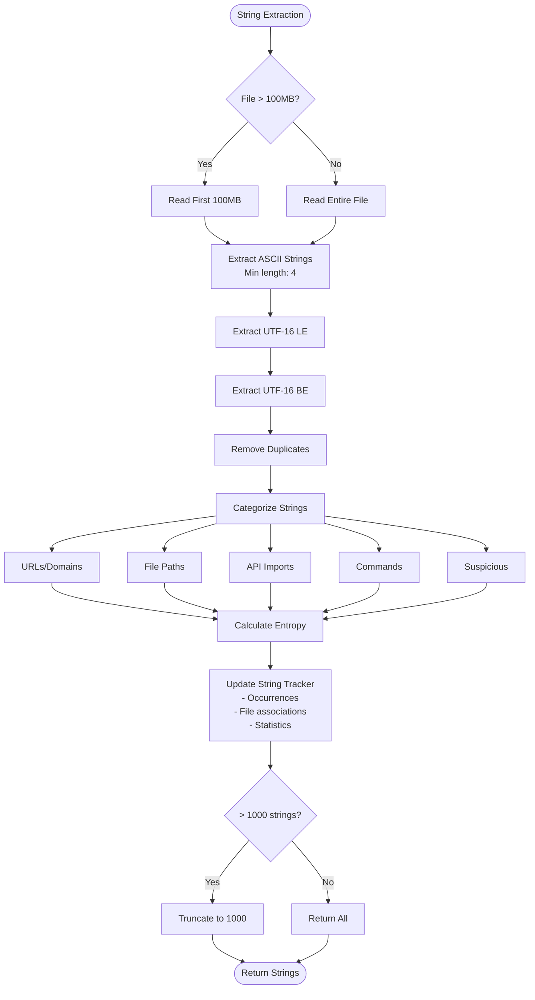
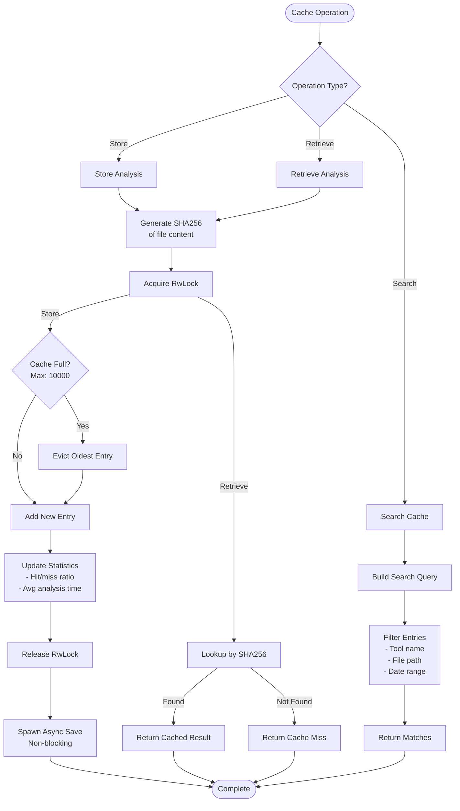
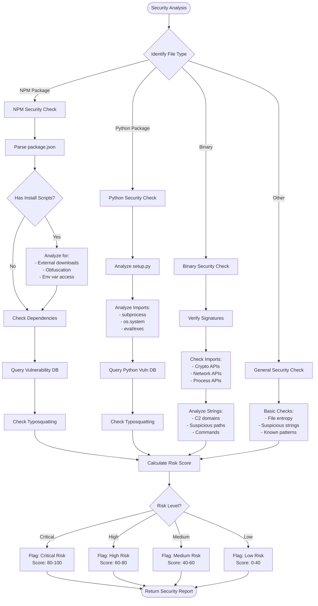

# File Scanner Execution Flow & Decision Tree

## Main Execution Flow

## Hash Calculation Subprocess

## String Extraction Flow

## Cache Operation Flow

## Security Analysis Decision Tree

## Key Decision Points & Performance Optimizations

### 1. **Concurrency Control**
- Global semaphores limit resource usage
- Async operations prevent blocking
- Parallel hash calculations improve throughput

### 2. **Memory Management**
- 100MB limit on file reads for strings
- 1000 string output limit
- LRU cache eviction at 10,000 entries

### 3. **Error Recovery**
- Graceful degradation when components fail
- Optional analyses don't block core functionality
- Detailed error messages for debugging

### 4. **Performance Shortcuts**
- SHA256-based cache lookups
- Early exit for unsupported file types
- Streaming reads for large files

### 5. **Security Priorities**
- Vulnerability databases checked first
- Known malicious patterns prioritized
- Risk scoring guides analysis depth

## Architecture Insights

### What Works Well

1. **Async-First Design**: Non-blocking operations throughout
2. **Resource Pooling**: Prevents system overload
3. **Modular Analysis**: Each component independent
4. **Smart Caching**: Content-based identification
5. **Security Focus**: Multiple detection layers

### Areas for Enhancement

1. **Streaming Architecture**: For files > 100MB
2. **Plugin System**: Dynamic analyzer loading
3. **Distributed Processing**: Multi-node support
4. **ML Integration**: Advanced pattern detection
5. **Real-time Monitoring**: File system watches

### Performance Characteristics

- **Startup Time**: < 100ms
- **Small Files (< 1MB)**: < 500ms full analysis
- **Large Files (> 100MB)**: Linear scaling with size
- **Cache Hit**: < 10ms response time
- **Concurrent Files**: Up to 10 parallel analyses