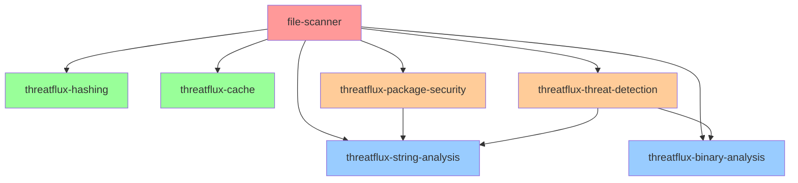

# ThreatFlux Library Overview

This document provides a comprehensive overview of all ThreatFlux libraries in the file-scanner project, their relationships, use cases, and how to choose the right components for your needs.

## 📋 Quick Reference

| Library | Purpose | Status | Features | Use Cases |
|---------|---------|--------|----------|-----------|
| [threatflux-hashing](#threatflux-hashing) | Cryptographic hash calculations | ✅ Stable | Async MD5/SHA256/SHA512/BLAKE3 | File integrity, deduplication |
| [threatflux-cache](#threatflux-cache) | Flexible caching system | ✅ Stable | Multiple backends, eviction policies | Performance optimization |
| [threatflux-string-analysis](#threatflux-string-analysis) | String extraction & analysis | ✅ Stable | Pattern matching, categorization | Malware analysis, forensics |
| [threatflux-binary-analysis](#threatflux-binary-analysis) | Binary format analysis | 🚧 Beta | PE/ELF/Mach-O parsing | Executable analysis, reversing |
| [threatflux-package-security](#threatflux-package-security) | Package security scanning | 🚧 Beta | npm/Python/Java analysis | Supply chain security |
| [threatflux-threat-detection](#threatflux-threat-detection) | Threat & malware detection | 🚧 Beta | YARA rules, behavioral analysis | Security research, SOC |

## 🎯 Library Categories

### Core Infrastructure Libraries

These libraries provide fundamental functionality that other components depend on:

#### threatflux-hashing
- **Primary Purpose**: High-performance cryptographic hash calculations
- **Key Features**: Async processing, concurrent operations, multiple algorithms
- **Dependencies**: None (leaf library)
- **Performance**: Optimized for large files with configurable buffer sizes

#### threatflux-cache
- **Primary Purpose**: Flexible caching system with multiple backends
- **Key Features**: Memory/filesystem backends, eviction policies, search capabilities
- **Dependencies**: None (leaf library)
- **Performance**: Thread-safe concurrent access with configurable limits

### Analysis Libraries

These libraries perform specialized analysis on different types of data:

#### threatflux-string-analysis
- **Primary Purpose**: Extract and analyze strings from binary data
- **Key Features**: ASCII/Unicode extraction, pattern categorization, entropy analysis
- **Dependencies**: None (leaf library)
- **Performance**: Memory-efficient with configurable extraction limits

#### threatflux-binary-analysis
- **Primary Purpose**: Parse and analyze binary file formats
- **Key Features**: PE/ELF/Mach-O support, section analysis, compiler detection
- **Dependencies**: None (leaf library)
- **Performance**: Memory-mapped file access for large binaries

#### threatflux-package-security
- **Primary Purpose**: Security analysis of software packages
- **Key Features**: Vulnerability scanning, typosquatting detection, dependency analysis
- **Dependencies**: threatflux-string-analysis (for pattern detection)
- **Performance**: Concurrent analysis with vulnerability database caching

### Detection Libraries

These libraries implement security and threat detection capabilities:

#### threatflux-threat-detection
- **Primary Purpose**: Advanced threat and malware detection
- **Key Features**: YARA rules, behavioral patterns, IoC matching
- **Dependencies**: threatflux-string-analysis, threatflux-binary-analysis
- **Performance**: Rule engine with optimized pattern matching

## 🔗 Dependency Relationships



## 🎨 Use Case Matrix

| Use Case | Primary Libraries | Supporting Libraries | Example Scenario |
|----------|------------------|---------------------|------------------|
| **File Integrity Verification** | threatflux-hashing | threatflux-cache | Verify downloaded files |
| **Malware Analysis** | threatflux-binary-analysis, threatflux-string-analysis | threatflux-threat-detection | Reverse engineer samples |
| **Package Security Auditing** | threatflux-package-security | threatflux-cache | CI/CD pipeline security |
| **Forensic Investigation** | threatflux-string-analysis, threatflux-binary-analysis | threatflux-hashing | Digital forensics |
| **Threat Hunting** | threatflux-threat-detection | All libraries | SOC operations |
| **Performance Optimization** | threatflux-cache | All libraries | High-throughput scanning |

## 📊 Performance Characteristics

### Throughput Benchmarks

| Library | Operation | Typical Throughput | Memory Usage |
|---------|-----------|------------------|--------------|
| threatflux-hashing | BLAKE3 hashing | ~1 GB/s | 64KB buffer |
| threatflux-string-analysis | String extraction | ~100 MB/s | 32MB limit |
| threatflux-binary-analysis | PE parsing | ~500 files/s | Memory-mapped |
| threatflux-package-security | Package analysis | ~50 packages/s | Variable |
| threatflux-threat-detection | YARA scanning | ~200 MB/s | Rule-dependent |

### Scaling Recommendations

- **Small files (< 1MB)**: All libraries perform well with default settings
- **Medium files (1-100MB)**: Increase buffer sizes, enable concurrent processing
- **Large files (> 100MB)**: Use memory mapping, stream processing, batch operations
- **High volume**: Combine with threatflux-cache for optimal performance

## 🚀 Getting Started Guide

### For Different Personas

#### Security Researcher
```toml
[dependencies]
threatflux-binary-analysis = { version = "0.1.0", features = ["all-formats"] }
threatflux-string-analysis = "0.1.0"
threatflux-threat-detection = { version = "0.1.0", features = ["yara", "behavioral"] }
```

#### DevOps Engineer
```toml
[dependencies]
threatflux-package-security = "0.1.0"
threatflux-hashing = { version = "0.1.0", features = ["blake3"] }
threatflux-cache = { version = "0.1.0", features = ["filesystem"] }
```

#### Forensic Analyst
```toml
[dependencies]
threatflux-hashing = { version = "0.1.0", features = ["all-algorithms"] }
threatflux-string-analysis = { version = "0.1.0", features = ["entropy"] }
threatflux-binary-analysis = { version = "0.1.0", features = ["pe", "elf"] }
```

#### Application Developer
```toml
[dependencies]
threatflux-hashing = "0.1.0"
threatflux-cache = { version = "0.1.0", features = ["memory"] }
```

## 🔧 Configuration Recommendations

### Development Environment
```toml
# Focus on fast iteration
[dependencies]
threatflux-hashing = { version = "0.1.0", features = ["blake3"] }
threatflux-cache = { version = "0.1.0", features = ["memory"] }
```

### Production Environment
```toml
# Focus on performance and persistence
[dependencies]
threatflux-hashing = { version = "0.1.0", features = ["all-algorithms"] }
threatflux-cache = { version = "0.1.0", features = ["filesystem", "compression"] }
threatflux-threat-detection = { version = "0.1.0", features = ["optimized-rules"] }
```

### Research Environment
```toml
# Focus on comprehensive analysis
[dependencies]
threatflux-binary-analysis = { version = "0.1.0", features = ["all-formats", "debug"] }
threatflux-string-analysis = { version = "0.1.0", features = ["entropy", "patterns"] }
threatflux-threat-detection = { version = "0.1.0", features = ["all-engines"] }
```

## 📦 Feature Flag Guide

### Common Feature Combinations

| Scenario | Recommended Features | Benefits |
|----------|---------------------|----------|
| **Basic Usage** | Default features only | Minimal dependencies, fast build |
| **High Performance** | `optimized`, `parallel` | Maximum throughput |
| **Full Analysis** | `all-features` | Comprehensive capabilities |
| **Minimal Binary** | `no-default-features` | Smallest possible binary |
| **Development** | `debug`, `tracing` | Better debugging experience |

## 🧩 Integration Patterns

### Pattern 1: Layered Analysis
```rust
use threatflux_hashing::calculate_all_hashes;
use threatflux_string_analysis::analyze_strings;
use threatflux_binary_analysis::parse_binary;

// Start with basic analysis
let hashes = calculate_all_hashes(&file_path).await?;
let strings = analyze_strings(&file_path).await?;

// Progress to advanced analysis if needed
if is_executable(&file_path) {
    let binary_info = parse_binary(&file_path).await?;
}
```

### Pattern 2: Pipeline Processing
```rust
use threatflux_cache::Cache;

let cache = Cache::new().await?;

// Use cache to avoid redundant work
if let Some(cached) = cache.get(&file_hash).await? {
    return Ok(cached);
}

// Perform analysis and cache results
let results = perform_analysis(&file_path).await?;
cache.put(file_hash, results.clone()).await?;
```

### Pattern 3: Concurrent Analysis
```rust
use tokio::task::JoinSet;

let mut tasks = JoinSet::new();

// Spawn concurrent analysis tasks
tasks.spawn(calculate_hashes(file_path.clone()));
tasks.spawn(extract_strings(file_path.clone()));
tasks.spawn(detect_threats(file_path.clone()));

// Collect results
let mut results = AnalysisResults::new();
while let Some(result) = tasks.join_next().await {
    match result? {
        AnalysisResult::Hashes(h) => results.hashes = h,
        AnalysisResult::Strings(s) => results.strings = s,
        AnalysisResult::Threats(t) => results.threats = t,
    }
}
```

## 🔍 Troubleshooting

### Common Issues

1. **Compilation Errors**: Check that all required features are enabled
2. **Performance Issues**: Review buffer sizes and concurrency settings
3. **Memory Usage**: Consider streaming APIs for large files
4. **Cache Misses**: Verify file hash consistency across analysis runs

### Debug Configuration

```toml
[dependencies]
threatflux-hashing = { version = "0.1.0", features = ["debug"] }
threatflux-cache = { version = "0.1.0", features = ["debug", "metrics"] }
```

### Logging Setup

```rust
use tracing::{info, debug};
use tracing_subscriber;

// Enable detailed logging for debugging
tracing_subscriber::fmt()
    .with_max_level(tracing::Level::DEBUG)
    .init();
```

## 🚦 Migration Guide

### From Monolithic to Modular

1. **Identify Dependencies**: Review which features your code actually uses
2. **Choose Libraries**: Select only the libraries you need
3. **Update Imports**: Change from unified imports to library-specific imports
4. **Test Thoroughly**: Verify functionality remains unchanged
5. **Optimize**: Take advantage of new configuration options

### Example Migration

**Before (Monolithic)**:
```rust
use file_scanner::{calculate_hashes, extract_strings, parse_binary};
```

**After (Modular)**:
```rust
use threatflux_hashing::calculate_all_hashes;
use threatflux_string_analysis::extract_strings;
use threatflux_binary_analysis::parse_binary;
```

## 📈 Roadmap

### Short Term (Q1 2025)
- Stabilize all beta libraries
- Complete API documentation
- Performance optimizations

### Medium Term (Q2-Q3 2025)
- Additional binary formats
- Machine learning integration
- Cloud deployment tools

### Long Term (Q4 2025+)
- Real-time streaming analysis
- Distributed processing
- Custom plugin architecture

## 📚 Additional Resources

- [Installation Guide](docs/INSTALLATION.md)
- [API Documentation](docs/API.md)
- [Performance Guide](PERFORMANCE_GUIDE.md)
- [Security Considerations](SECURITY_CONSIDERATIONS.md)
- [Migration Guide](MIGRATION_GUIDE.md)

## 🤝 Contributing

Each library welcomes contributions! See the individual library README files for specific contribution guidelines, or refer to the main [CONTRIBUTING.md](CONTRIBUTING.md) for general guidelines.

## 📄 License

All ThreatFlux libraries are licensed under the MIT license. See individual library directories for specific license files.