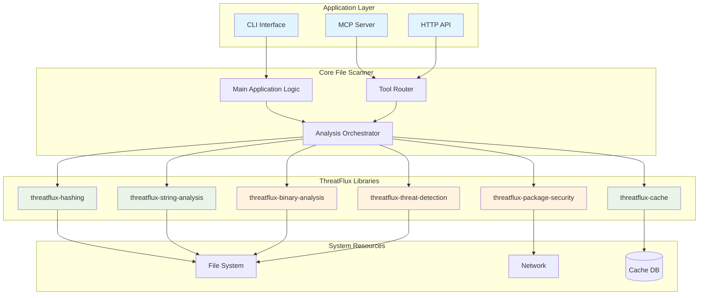

# Architecture

This document describes the modular architecture and design of the File Scanner project, built using specialized ThreatFlux libraries.

## Table of Contents

- [Overview](#overview)
- [Modular Architecture](#modular-architecture)
- [ThreatFlux Libraries](#threatflux-libraries)
- [Core Application](#core-application)
- [Data Flow](#data-flow)
- [Integration Patterns](#integration-patterns)
- [Concurrency Model](#concurrency-model)
- [Error Handling](#error-handling)
- [Extension Points](#extension-points)

## Overview

File Scanner follows a **modular, library-based architecture** designed for:

- **Modularity**: Independent libraries that can be used separately
- **Performance**: Async-first design with parallel processing
- **Extensibility**: Easy to add new analysis capabilities
- **Maintainability**: Clear separation of concerns between libraries
- **Reusability**: Libraries can be used in other projects
- **Flexibility**: Mix and match capabilities as needed

## Modular Architecture



## ThreatFlux Libraries

### Core Infrastructure Libraries

#### threatflux-hashing
```rust
// High-performance async hash calculations
use threatflux_hashing::{calculate_all_hashes, HashConfig};

let config = HashConfig::default()
    .with_algorithms(HashAlgorithms::all())
    .with_buffer_size(16384);
    
let hashes = calculate_all_hashes_with_config(&file_path, &config).await?;
```

**Architecture:**
- Zero dependencies (leaf library)
- Async-first with tokio
- Concurrent algorithm processing
- Configurable buffer sizes
- Memory-efficient streaming

#### threatflux-cache
```rust
// Flexible caching with multiple backends
use threatflux_cache::{Cache, CacheConfig, FilesystemBackend};

let backend = FilesystemBackend::new("/tmp/cache").await?;
let cache: Cache<String, AnalysisResult> = Cache::new(
    CacheConfig::default(),
    backend
).await?;
```

**Architecture:**
- Pluggable backend system
- Async storage operations
- Thread-safe concurrent access
- Multiple eviction policies
- Persistent storage support

### Analysis Libraries

#### threatflux-string-analysis
```rust
// Advanced string extraction and categorization
use threatflux_string_analysis::{StringAnalyzer, AnalysisConfig};

let analyzer = StringAnalyzer::new(AnalysisConfig::default());
let results = analyzer.analyze_file(&file_path).await?;
```

**Architecture:**
- Pattern-based categorization
- Entropy analysis
- Encoding detection
- Memory-efficient processing
- Customizable extraction rules

#### threatflux-binary-analysis
```rust
// Binary format parsing and analysis
use threatflux_binary_analysis::{BinaryAnalyzer, SupportedFormat};

let analyzer = BinaryAnalyzer::new();
let info = analyzer.analyze(&file_path).await?;
```

**Architecture:**
- Format-specific parsers (PE/ELF/Mach-O)
- Memory-mapped file access
- Section and symbol analysis
- Compiler detection
- Disassembly capabilities

### Security Libraries

#### threatflux-package-security
```rust
// Package vulnerability and security analysis
use threatflux_package_security::{PackageAnalyzer, PackageType};

let analyzer = PackageAnalyzer::new().await?;
let analysis = analyzer.analyze_package(&package_path, PackageType::Npm).await?;
```

**Architecture:**
- Multi-language support (npm, Python, Java)
- Vulnerability database integration
- Typosquatting detection
- Dependency analysis
- Supply chain risk assessment

#### threatflux-threat-detection
```rust
// Advanced threat and malware detection
use threatflux_threat_detection::{ThreatDetector, DetectionConfig};

let detector = ThreatDetector::new(DetectionConfig::default()).await?;
let threats = detector.scan_file(&file_path).await?;
```

**Architecture:**
- YARA rule engine
- Behavioral pattern analysis
- IoC matching
- Rule compilation and caching
- Extensible detection modules

## Core Application

### Application Entry Points

```rust
// src/main.rs - CLI Interface
#[tokio::main]
async fn main() -> Result<()> {
    let cli = Cli::parse();
    match cli.command {
        Commands::Scan { options } => run_scanner(options).await,
        Commands::McpStdio => run_mcp_stdio().await,
        Commands::McpHttp { port } => run_mcp_http(port).await,
    }
}
```

### Analysis Orchestrator

```rust
pub struct AnalysisOrchestrator {
    hashing: Arc<ThreatFluxHashing>,
    cache: Arc<ThreatFluxCache>,
    strings: Arc<ThreatFluxStringAnalysis>,
    binary: Option<Arc<ThreatFluxBinaryAnalysis>>,
    packages: Option<Arc<ThreatFluxPackageSecurity>>,
    threats: Option<Arc<ThreatFluxThreatDetection>>,
}

impl AnalysisOrchestrator {
    pub async fn analyze_file(&self, path: &Path, options: &AnalysisOptions) -> Result<AnalysisResult> {
        // Check cache first
        let file_hash = self.calculate_file_hash(path).await?;
        if let Some(cached) = self.cache.get(&file_hash).await? {
            return Ok(cached);
        }
        
        // Perform requested analyses
        let mut tasks = Vec::new();
        
        if options.metadata {
            tasks.push(tokio::spawn(self.extract_metadata(path.to_path_buf())));
        }
        
        if options.hashes {
            tasks.push(tokio::spawn(self.hashing.calculate_all_hashes(path.to_path_buf())));
        }
        
        if options.strings {
            tasks.push(tokio::spawn(self.strings.analyze_file(path.to_path_buf())));
        }
        
        // Collect results and cache
        let results = join_all(tasks).await;
        let analysis_result = AnalysisResult::from(results);
        
        self.cache.put(file_hash, analysis_result.clone()).await?;
        Ok(analysis_result)
    }
}
```

### MCP Integration

```rust
pub struct FileAnalysisServer {
    orchestrator: Arc<AnalysisOrchestrator>,
}

impl McpServer for FileAnalysisServer {
    async fn handle_tool_call(&self, tool_name: &str, args: Value) -> Result<Value> {
        match tool_name {
            "analyze_file" => {
                let request: AnalyzeFileRequest = serde_json::from_value(args)?;
                let result = self.orchestrator.analyze_file(&request.file_path, &request.options).await?;
                Ok(serde_json::to_value(result)?)
            }
            "llm_analyze_file" => {
                let request: LlmAnalyzeFileRequest = serde_json::from_value(args)?;
                let result = self.orchestrator.llm_optimized_analysis(&request.file_path, &request).await?;
                Ok(serde_json::to_value(result)?)
            }
            _ => Err(McpError::MethodNotFound(tool_name.to_string()))
        }
    }
}
```

## Data Flow

### Library Integration Flow

```text
File Input
    │
    ├─► threatflux-hashing
    │   ├─► MD5 (parallel)
    │   ├─► SHA256 (parallel)
    │   ├─► SHA512 (parallel)
    │   └─► BLAKE3 (parallel)
    │
    ├─► threatflux-string-analysis
    │   ├─► String extraction
    │   ├─► Pattern categorization
    │   ├─► Entropy analysis
    │   └─► Suspicious detection
    │
    ├─► threatflux-binary-analysis
    │   ├─► Format detection
    │   ├─► Section parsing
    │   ├─► Symbol analysis
    │   └─► Compiler detection
    │
    ├─► threatflux-package-security
    │   ├─► Package type detection
    │   ├─► Vulnerability scanning
    │   ├─► Dependency analysis
    │   └─► Supply chain assessment
    │
    └─► threatflux-threat-detection
        ├─► YARA rule matching
        ├─► Behavioral analysis
        ├─► IoC detection
        └─► Risk scoring
    
Results Aggregation
    │
    ├─► threatflux-cache (storage)
    │
    └─► Output Formatting
        ├─► JSON
        ├─► YAML
        └─► MCP Response
```

### Dependency Graph

```text
file-scanner (main app)
├── threatflux-hashing (✅ stable)
├── threatflux-cache (✅ stable)  
├── threatflux-string-analysis (✅ stable)
├── threatflux-binary-analysis (🚧 beta)
├── threatflux-package-security (🚧 beta)
│   └── threatflux-string-analysis
└── threatflux-threat-detection (🚧 beta)
    ├── threatflux-string-analysis
    └── threatflux-binary-analysis
```

## Integration Patterns

### Pattern 1: Progressive Analysis

```rust
use threatflux_hashing::calculate_md5;
use threatflux_binary_analysis::BinaryAnalyzer;

async fn progressive_analysis(file_path: &Path) -> Result<AnalysisLevel> {
    // Quick hash check
    let md5 = calculate_md5(file_path).await?;
    if is_known_safe(&md5) {
        return Ok(AnalysisLevel::Basic);
    }
    
    // If suspicious, perform deeper analysis
    let binary_analyzer = BinaryAnalyzer::new();
    if binary_analyzer.is_executable(file_path).await? {
        let analysis = binary_analyzer.analyze(file_path).await?;
        return Ok(AnalysisLevel::Deep(analysis));
    }
    
    Ok(AnalysisLevel::Standard)
}
```

### Pattern 2: Parallel Library Usage

```rust
use tokio::task::JoinSet;

async fn parallel_analysis(file_path: &Path) -> Result<CombinedResults> {
    let mut tasks = JoinSet::new();
    
    // Spawn parallel analysis tasks
    tasks.spawn(hash_analysis(file_path.to_path_buf()));
    tasks.spawn(string_analysis(file_path.to_path_buf()));
    tasks.spawn(binary_analysis(file_path.to_path_buf()));
    
    let mut results = CombinedResults::new();
    
    // Collect results as they complete
    while let Some(result) = tasks.join_next().await {
        match result? {
            AnalysisType::Hash(h) => results.hashes = Some(h),
            AnalysisType::Strings(s) => results.strings = Some(s),
            AnalysisType::Binary(b) => results.binary = Some(b),
        }
    }
    
    Ok(results)
}
```

### Pattern 3: Cached Analysis Pipeline

```rust
use threatflux_cache::{Cache, CacheKey};

pub struct CachedAnalyzer {
    cache: Cache<CacheKey, AnalysisResult>,
    libraries: LibraryCollection,
}

impl CachedAnalyzer {
    async fn analyze(&self, file_path: &Path) -> Result<AnalysisResult> {
        let cache_key = CacheKey::from_file(file_path).await?;
        
        // Check cache first
        if let Some(cached) = self.cache.get(&cache_key).await? {
            return Ok(cached);
        }
        
        // Perform analysis using libraries
        let result = self.libraries.analyze_comprehensive(file_path).await?;
        
        // Cache the result
        self.cache.put(cache_key, result.clone()).await?;
        
        Ok(result)
    }
}
```

## Concurrency Model

### Library-Level Concurrency

Each ThreatFlux library implements its own concurrency strategy:

- **threatflux-hashing**: Parallel algorithm execution
- **threatflux-cache**: Thread-safe storage operations
- **threatflux-string-analysis**: Concurrent pattern matching
- **threatflux-binary-analysis**: Async file parsing
- **threatflux-package-security**: Parallel dependency analysis
- **threatflux-threat-detection**: Concurrent rule evaluation

### Application-Level Orchestration

```rust
pub struct ConcurrencyConfig {
    pub max_concurrent_files: usize,
    pub max_concurrent_libraries: usize,
    pub library_specific: HashMap<String, usize>,
}

impl AnalysisOrchestrator {
    async fn analyze_batch(&self, files: Vec<PathBuf>) -> Result<Vec<AnalysisResult>> {
        let semaphore = Semaphore::new(self.config.max_concurrent_files);
        let mut tasks = Vec::new();
        
        for file in files {
            let permit = semaphore.acquire().await?;
            let orchestrator = self.clone();
            
            tasks.push(tokio::spawn(async move {
                let _permit = permit;
                orchestrator.analyze_file(&file, &AnalysisOptions::default()).await
            }));
        }
        
        let results = join_all(tasks).await;
        Ok(results.into_iter().collect::<Result<Vec<_>, _>>()?)
    }
}
```

## Error Handling

### Library Error Types

```rust
// Each library defines its own error types
use threatflux_hashing::HashError;
use threatflux_cache::CacheError;
use threatflux_string_analysis::StringAnalysisError;

#[derive(Error, Debug)]
pub enum FileAnalysisError {
    #[error("Hash calculation failed: {0}")]
    Hash(#[from] HashError),
    
    #[error("Cache operation failed: {0}")]
    Cache(#[from] CacheError),
    
    #[error("String analysis failed: {0}")]
    StringAnalysis(#[from] StringAnalysisError),
    
    #[error("Library not available: {library}")]
    LibraryUnavailable { library: String },
    
    #[error("Analysis timeout after {seconds}s")]
    Timeout { seconds: u64 },
}
```

### Error Aggregation Strategy

```rust
pub struct AnalysisResult {
    pub successful_analyses: HashMap<String, Value>,
    pub failed_analyses: HashMap<String, String>,
    pub partial_results: HashMap<String, Value>,
}

impl AnalysisOrchestrator {
    async fn analyze_with_error_handling(&self, file_path: &Path) -> AnalysisResult {
        let mut result = AnalysisResult::new();
        
        // Try each library, collecting successes and failures
        if let Ok(hashes) = self.hashing.calculate_all_hashes(file_path).await {
            result.successful_analyses.insert("hashes".to_string(), json!(hashes));
        } else {
            result.failed_analyses.insert("hashes".to_string(), "Hash calculation failed".to_string());
        }
        
        // Continue with other libraries even if some fail
        // ...
        
        result
    }
}
```

## Extension Points

### Adding New Libraries

1. **Create Library**: Follow ThreatFlux library conventions
2. **Define Interface**: Implement common analysis traits
3. **Integration**: Add to orchestrator dependency injection
4. **Configuration**: Add library-specific configuration options
5. **Testing**: Create integration tests

### Library Development Template

```rust
// threatflux-new-analysis/src/lib.rs
use async_trait::async_trait;
use std::path::Path;

#[async_trait]
pub trait NewAnalysisCapability {
    type Config;
    type Result;
    type Error;
    
    async fn analyze(&self, file_path: &Path) -> Result<Self::Result, Self::Error>;
}

pub struct NewAnalyzer {
    config: NewAnalysisConfig,
}

impl NewAnalyzer {
    pub fn new(config: NewAnalysisConfig) -> Self {
        Self { config }
    }
}

#[async_trait]
impl NewAnalysisCapability for NewAnalyzer {
    type Config = NewAnalysisConfig;
    type Result = NewAnalysisResult;
    type Error = NewAnalysisError;
    
    async fn analyze(&self, file_path: &Path) -> Result<Self::Result, Self::Error> {
        // Implementation
        todo!()
    }
}
```

### Adding MCP Tools

```rust
// Register new tool in MCP server
impl FileAnalysisServer {
    fn register_tools(&self) -> Vec<ToolDefinition> {
        vec![
            // Existing tools...
            ToolDefinition {
                name: "new_analysis_tool".to_string(),
                description: "Performs new type of analysis".to_string(),
                input_schema: json!({
                    "type": "object",
                    "properties": {
                        "file_path": {"type": "string"},
                        "options": {"type": "object"}
                    }
                }),
            }
        ]
    }
    
    async fn handle_new_analysis_tool(&self, args: Value) -> Result<Value> {
        // Implementation using new library
        todo!()
    }
}
```

## Performance Considerations

### Library Performance Characteristics

| Library | Typical Throughput | Memory Usage | Scaling Factor |
|---------|------------------|--------------|----------------|
| threatflux-hashing | 500MB/s - 1GB/s | 64KB buffers | Linear with file size |
| threatflux-string-analysis | 100MB/s | 32MB limit | Linear with content |
| threatflux-binary-analysis | 500 files/s | Memory-mapped | Constant per file |
| threatflux-cache | 10K ops/s | Configurable | Constant per operation |

### Optimization Strategies

1. **Selective Analysis**: Only use needed libraries
2. **Parallel Execution**: Utilize multiple libraries concurrently
3. **Caching**: Leverage threatflux-cache for expensive operations
4. **Streaming**: Use streaming APIs for large files
5. **Configuration Tuning**: Optimize library-specific settings

## Security Considerations

### Library Isolation

Each ThreatFlux library implements its own security measures:

- Input validation and sanitization
- Resource usage limits
- Timeout mechanisms
- Safe parsing with bounds checking

### Application Security

```rust
pub struct SecurityPolicy {
    pub max_file_size: u64,
    pub analysis_timeout: Duration,
    pub allowed_file_types: HashSet<String>,
    pub sandbox_mode: bool,
}

impl AnalysisOrchestrator {
    async fn secure_analyze(&self, file_path: &Path) -> Result<AnalysisResult> {
        // Validate file before analysis
        self.validate_file(file_path)?;
        
        // Apply resource limits
        let _guard = ResourceGuard::new(&self.security_policy);
        
        // Perform analysis with timeout
        tokio::time::timeout(
            self.security_policy.analysis_timeout,
            self.analyze_file(file_path, &AnalysisOptions::default())
        ).await?
    }
}
```

## Future Architecture Goals

### Short Term (Q1 2025)
- Complete modularization of all components
- Stabilize all ThreatFlux libraries
- Performance optimization across libraries

### Medium Term (Q2-Q3 2025)
- Plugin system for custom libraries
- Distributed analysis capabilities
- Enhanced caching strategies

### Long Term (Q4 2025+)
- Real-time analysis streaming
- Machine learning integration
- Cloud-native deployment options
- Custom rule engines

## Testing Architecture

### Library Testing

Each ThreatFlux library includes:
- Unit tests for core functionality
- Integration tests with real files
- Performance benchmarks
- Property-based testing

### Application Testing

```rust
#[cfg(test)]
mod tests {
    use super::*;
    use threatflux_cache::MemoryBackend;
    
    #[tokio::test]
    async fn test_orchestrator_integration() {
        let orchestrator = AnalysisOrchestrator::new_for_testing().await;
        let result = orchestrator.analyze_file(
            Path::new("test_files/sample.exe"),
            &AnalysisOptions::all()
        ).await?;
        
        assert!(result.hashes.is_some());
        assert!(result.strings.is_some());
        assert!(result.binary_info.is_some());
    }
}
```

### Performance Testing

```rust
#[cfg(test)]
mod benches {
    use criterion::{criterion_group, criterion_main, Criterion};
    
    fn bench_full_analysis(c: &mut Criterion) {
        let rt = tokio::runtime::Runtime::new().unwrap();
        
        c.bench_function("full_analysis", |b| {
            b.to_async(&rt).iter(|| async {
                let orchestrator = AnalysisOrchestrator::new().await;
                orchestrator.analyze_file(
                    Path::new("benches/test_binary"),
                    &AnalysisOptions::all()
                ).await
            })
        });
    }
    
    criterion_group!(benches, bench_full_analysis);
    criterion_main!(benches);
}
```